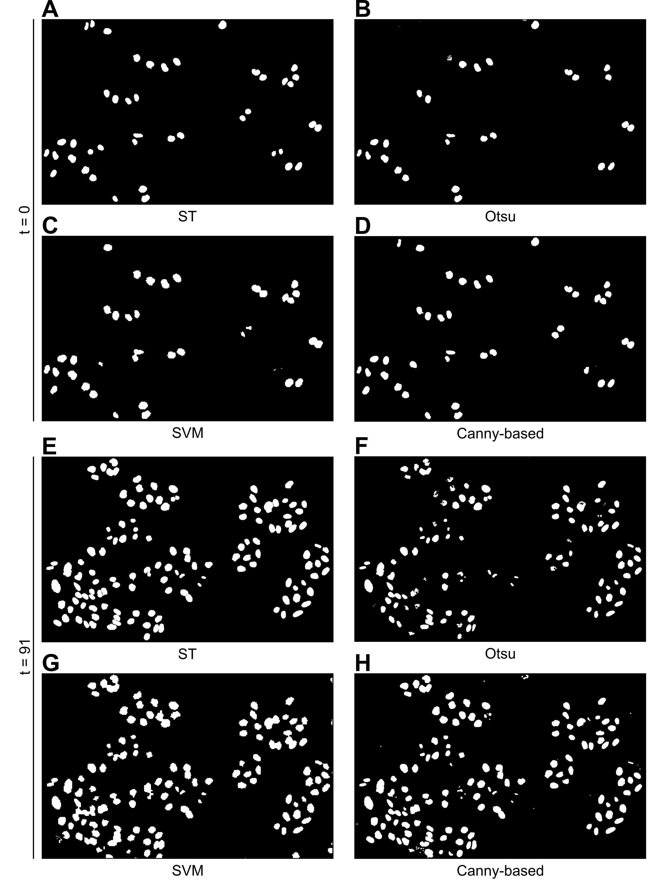
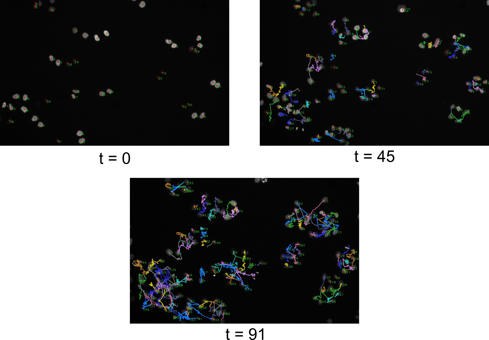

# Nuclear Segmentation and Cell Tracking in Fluorescence Microscopy
Internship at BioQuant, Heidelberg, 2022

## Project Overview
This project was conducted in the Biomedical Computer Vision (BMCV)
Group, which belongs to Heidelberg University, BioQuant Center, Institute of Pharmacy
and Molecular Biotechnology, and the German Cancer Research Center in Heidelberg.

### Nuclear Segmentation
**Task**: With the diversity of imaging modalities, segmentation tasks, and available algorithms, we
aimed to provide a structured and detailed overview of the performance of common approaches.
Utilizing a temporal image sequence of human epithelial cervix carcinoma cells, we compared
automated thresholding, machine learning, and an edge-based approach. Besides indicators for
similarity to ground truth, we incorporated metrics into the assessment which consider the algorithm’s
practical usability.

**Data Exploration**: A dataset of nuclei was obtained from the 6th [Cell Tracking Challenge](http://celltrackingchallenge.net/) edition of the International Symposium on Biomedical Imaging (ISBI) 2021 (Ulman et al., 2017).
`data_exploration.py` contains code that was used to gain an overview and test several segmentation approaches on the data.

**Segmentation**: In `segmentation.py`, segmentation approaches based on edge detection, Otsu's method and machine learning (support vector machine) were compared in terms of their performance on the data.
Ground truth images allowed for evaluation using dice and jaccard scores on a whole image as well as a per-object level using the [*segmetrics*](https://github.com/BMCV/segmetrics) package developed in the BMCV group.

  
   
  ST: Silver truth, SVM: Support vector machine

### Cell Tracking
**Task**: Utilize the Canny-based segmentation approach, which yielded the best result, to track nuclei in the temporal image sequence at hand.

**Tracking**: In `tracking.py` centroids of nuclei were extracted and listed in a data frame including spatial information. Nuclei labels were passed on to the respective nearest neighbor of the next frame based on Euclidean distance.

**Vizualizatio**: Cell tracking was vizualized and evaluated using the *opencv-python* package. The code is available in `tracking_visuals.py`.

  

